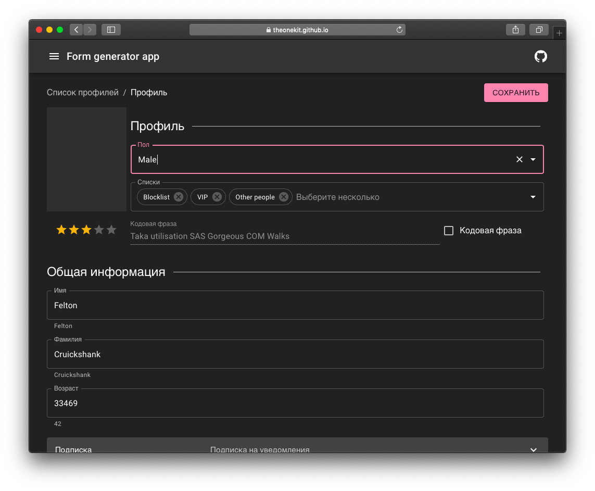

# one

> The one most advanced form creation kit for [React](https://reactjs.org/)



## Проблема

> Верная типизация не гарантирует содержание структуры

Является ли эта функция [pure](https://ru.wikipedia.org/wiki/Функциональное_программирование) функцией?

```
const sum = (a, b) => a + b;
```

На первый взгляд, да, однако...

```
const obj = new class {
  toString() { return Math.random().toString(36).substring(7) }
}

console.log(sum(obj, obj)) // uretdln9iue
console.log(sum(obj, obj)) // edzlrs4s6l8e
console.log(sum(obj, obj)) // 6l347arllc9q
console.log(sum(obj, obj)) // 529n5l8wn718
```

Верным вариантом написания pure функции будет функция с определенными входными параметрами...

```
const sum = (a: number, b: number) => a + b;
```

Это работает при использовании простых типов данных. Но при попытке определения сложного типа данных интерфейсом нет гарантии функциональной простоты внутренней реализации, так как интерфейс осуществляет проверку времени компиляции.

```
interface IObj {
  toString(): string;
}
```

На мой взгляд код, представленный ниже, следует назвать **синхронным** и **процедурным**, но никак **не функциональным**, так как расширение множества полей при поддержке кода можно назвать сайд-эффектом

```
import { connect } from 'react-redux'
import { formValueSelector } from 'redux-form'

...

const selector = formValueSelector('selectingFormValues') 
SelectingFormValuesForm = connect((state) => {
  const hasEmailValue = selector(state, 'hasEmail')
  const favoriteColorValue = selector(state, 'favoriteColor')
  const { firstName, lastName } = selector(state, 'firstName', 'lastName')
  return {
    hasEmailValue,
    favoriteColorValue,
    canSubscribeByEmail: firstName && lastName,
    fullName: `${firstName || ''} ${lastName || ''}`
)(SelectingFormValuesForm)
```

Функция `mapStateToProps` при подобном использовании имеет бесконечный список возвращаемых значений, он расширяется при последующих итерациях разработки вместе с интерфейсом, осуществляющим определение свойств компонента.

## Решение

> Обеспечив обособленность добавления новых полей в форму, мы можем радикально увеличить количество чистых функций, избавившись от процедурного кода

Созданный компонент умеет:

 - **Выводить верстку**

    Указывая `phoneColomns`, `tabletColumns`, `desktopColumns`. Либо просто `columns`, если не хочется заморачиваться. Поля можно группировать, группы могут быть вложенными.

 - **Выводить JSON, получаемый из Promise**

    Во время загрузки показывается *placeholder*, выраженный [Skeleton](https://material-ui.com/components/skeleton/). После загрузки отображается форма.

 - **Подключаться к состоянию компонента непосредственно**

    Также, `One` можно подключить к объекту во внутреннем состоянии компонента напрямую. Очень удобно, особенно при отрисовке списка шаблонных элементов...

 - **Скрывать, отключать, сообщать пользователю о ошибке ввода полей**

    Используя коллбеки `isDisabled`, `isVisible`, `isInvalid` мы можем отключать, скрывать и помечать невалидный ввод. Кроме того, мы можем подписаться на `focus` и `blur` как для одного поля, так и для группы полей (всплытие) или всего `One` компонента. Поле можно пометить `readonly` или указать коллбек `compute` для вычисления значения.
  
 - **Автоматизировать создание внутреннего состояния**

    После декларативного описания формы работа через коллбеки осуществляется в функциональном стиле c передачей snapshot последнего объекта с данными из полей ввода (immutable). Также, при необходимости можно осуществить асинхронные запросы. Для текстовых полей уже применен `debounce`, оптимизация количества проверок ввода...

 - **Принцип единой ответственности**

    Что если нужно реализовать возможность подписаться на email рассылку (форма из нескольких вложенных компонентов взаимодействующих через цепочку state-props), но только для тех пользователей, у которых указано отчество? Создавать контекст потенциально не безопасно, так как не гарантирует отсутствие новых правок.

 - **Уведомлять прикладного программиста об изменениях на форме**

    Передав коллбек в входной параметр `One` компонента `change`, мы можем получить пользовательский ввод, но вызовется коллбек только если все валидации успешно пройдены

 - **Выводить более 10 встроенных типов полей и пользовательские компоненты**

    Доступны компоненты Switch (переключатель), Line (очерк группы), Group (группа полей), Expansion (сворачиваемая группа), Radio (радио-кнопка), Checkbox (чекбокс), Text (Текстовое поле), Progress (Прогрессбар), Slider (слайдер), Combo (выпадающий список), Items (множественный список), Rating (рейтинг) и Component (пользовательский компонент)

 - **Скорее всего, данный список уже устарел**

    Компонент активно дополняется)

 ## Пример кода

 > Просто откройте в своем браузере...

 Попробуйте поэкспериментировать c `isDisabled`, `isInvalid`, `isVisible`. Демо можно посмотреть онлайн [тут](https://theonekit.github.io/wordpress-interop/). Исходный код компонента открыт, его можно лицезреть [тут](https://github.com/tripolskypetr/material-ui-umd/tree/master/lib/form-tools).

 ```
<script src="https://theonekit.github.io/index.js"></script>

<div id="mount-point"></div>

<script>
  (function () {

    const {
      createElement: h,
    } = React;

    const {
      One,
    } = form;

    const {
      SquareFoot,
      LensOutlined,
      VolumeDown,
      VolumeUp,
    } = material.icons;

    const Logger = (props) => h('i', null, 
      h('pre', null, 
        JSON.stringify(props, Object.keys(props).sort(), 2)
      )
    );

    const focus = () => console.log('focus');
    const blur = () => console.log('blur');

    const fields = [
      {
        type: "group",
        fields: [
          {
            type: "line",
            title: "Вид стекла"
          },
          {
            title: "Бронза",
            columns: "4",
            type: "checkbox",
            name: "Бронза"
          },
          {
            title: "Матовое",
            columns: "4",
            type: "checkbox",
            name: "Матовое"
          },
          {
            title: "Осветленное",
            type: "checkbox",
            columns: "4",
            name: "Осветленное"
          },
          {
            title: "Прозрачное",
            type: "checkbox",
            columns: "4",
            name: "Прозрачное"
          },
          {
            title: "Серое",
            columns: "4",
            type: "checkbox",
            name: "Серое"
          },
          {
            type: "group",
            fields: [
              {
                type: "line",
                title: "Толщина стекла"
              },
              {
                title: "10 мм",
                type: "radio",
                name: "Толщина стекла",
                radioValue: "10 мм"
              },
              {
                title: "12 мм",
                type: "radio",
                name: "Толщина стекла",
                radioValue: "12 мм"
              },
              {
                title: "3 мм",
                type: "radio",
                name: "Толщина стекла",
                radioValue: "3 мм"
              },
              {
                title: "4 мм",
                type: "radio",
                name: "Толщина стекла",
                radioValue: "4 мм"
              },
              {
                title: "5 мм",
                type: "radio",
                name: "Толщина стекла",
                radioValue: "5 мм"
              },
              {
                title: "6 мм",
                type: "radio",
                name: "Толщина стекла",
                radioValue: "6 мм"
              },
              {
                title: "8 мм",
                type: "radio",
                name: "Толщина стекла",
                radioValue: "8 мм"
              },
              {
                type: "group",
                fields: [
                  {
                    type: "line",
                    title: "Форма изделия"
                  },
                  {
                    type: "group",
                    columns: "6",
                    fields: [
                      {
                        type: "line",
                        title: "Круг"
                      },
                      {
                        title: "Диаметр",
                        type: "text",
                        name: "Диаметр",
                        defaultValue: 5,
                        leadingIcon: LensOutlined,
                      },
                      {
                        type: "group",
                        fields: [
                          {
                            type: "line",
                            title: "Обработка (круг)"
                          },
                          {
                            title: "Полировка",
                            type: "text",
                            name: "Полировка"
                          },
                          {
                            title: "Резка",
                            type: "text",
                            name: "Резка"
                          }
                        ]
                      }
                    ]
                  },
                  {
                    type: "group",
                    columns: "6",
                    fields: [
                      {
                        type: "line",
                        title: "Прямоугольник"
                      },
                      {
                        title: "Длинна",
                        type: "text",
                        name: "Длинна",
                        defaultValue: 10,
                        inputType: 'number',
                        trailingIcon: SquareFoot,
                        isInvalid(obj) {
                          if (obj["Длинна"] < 10) {
                            return "Длинна не может быть меньше 10";
                          } else {
                            return null
                          }
                        },
                        trailingIconClick(v, onChange) { alert(v) }
                      },
                      {
                        title: "Ширина",
                        type: "text",
                        name: "Ширина",
                        defaultValue: 20,
                        isInvalid(obj) {
                          if (obj["Ширина"] < 20) {
                            return "Ширина не может быть меньше 20";
                          } else {
                            return null
                          }
                        },
                        inputType: 'number',
                        trailingIcon: SquareFoot,
                      },
                      {
                        title: "Площадь",
                        type: "text",
                        compute: (obj) => obj["Длинна"] * obj["Ширина"],
                        inputType: 'number',
                      },
                      {
                        type: "line",
                        title: "Доступно 500 единиц объема"
                      },
                      {
                        type: "progress",
                        compute: (obj) => obj["Длинна"] * obj["Ширина"],
                        maxPercent: 500,
                      },
                    ]
                  }
                ]
              }
            ]
          }
        ]
      },
      {
        type: "group",
        fields: [
          {
            type: "line",
            title: "Комментарий"
          },
          {
            title: "Комментарий",
            type: "text",
            name: "Комментарий",
            inputRows: 5,
          },
        ]
      },
      {
        type: "group",
        fields: [
          {
            type: "line",
            title: "Способ доставки"
          },
          {
            title: "Самовывоз",
            type: "switch",
            name: "Самовывоз",
            inputType: 'date',
          },
          {
            title: "Адрес",
            type: "text",
            name: "Адрес",
            focus, blur,
            isDisabled: (obj) => obj["Самовывоз"]
          },
        ]
      },
      {
        type: "line",
        title: "Слайдер",
      },
      {
        type: "slider",
        name: "Слайдер",
        leadingIcon: VolumeDown,
        trailingIcon: VolumeUp,
        leadingIconClick(v, onChange) { onChange(v - 1) },
        trailingIconClick(v, onChange) { onChange(v + 1) }
      },
      {
        type: "line",
        title: "Списки",
      },
      {
        type: "group",
        fields: [
          {
            type: "group",
            columns: "6",
            fields: [
              {
                type: "combo",
                title: "Выбор Элемента",
                description: "Выбор одного элемента",
                name: "Выбор Элемента",
                itemList: ["Элемент 1", "Элемент 2", "Элемент 3"]
              },
            ]
          },
          {
            type: "group",
            columns: "6",
            fields: [
              {
                type: "items",
                title: "Выбор Элементов",
                description: "Выбор нескольких элементов",
                name: "Выбор Элементов",
                itemList: ["Элемент 1", "Элемент 2", "Элемент 3"]
              },
            ]
          },
        ]
      },
      {
        type: "line",
        title: "Пользовательский компонент"
      },
      {
        type: "component",
        compute: Logger,
      },
      {
        type: "rating",
        name: "Рейтинг"
      }
    ];

    const change = (obj) => console.log({ obj });

    const App = () => h(One, { fields, change });

    ReactDOM.render(h(App), document.getElementById('mount-point'));

  })();

</script>
 ```
